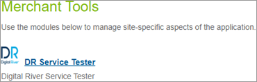
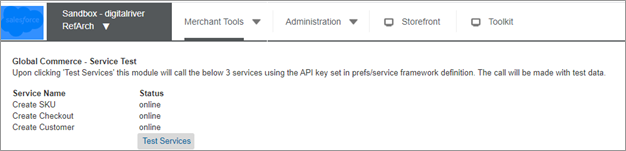

# User guide

## Roles, responsibilities

Run the SKU Creation job any time you add new products to the catalog.

## Business Manager

Added a new Business Manager menu option under Merchant Tools.

To send calls to the web services listed under Global Commerce – Service Test, click Test Services.

