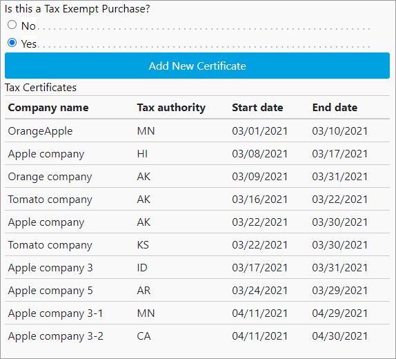

# User guide

## Product management

Product management consists of two aspects. First, the required product attributes must be configured for each product/SKU. Next, the products must be synced to Digital River. This section details those steps.

Before Digital River can process the SKUs, you must complete all of the products with both the Tax Class and the Digital River custom attributes and send them to Digital River. This data is necessary for valid tax calculations. The absence of these attributes will result in errors when you run the SKU export job.

Digital River needs the optional Harmonized System (HS) Code property for duty calculation.


**Note**: If your Digital River account is configured for [Landed Costs](https://docs.digitalriver.com/digital-river-api/integration-options/checkouts/creating-checkouts/landed-costs), you will need to configure the Harmonized System (HS) Code on applicable products. This cartridge code processes duty and appears to customers as a separate total price component without any additional site configuration. To avoid duty inclusion, leave HS Code attributes blank or contact your Digital River representative.




**Note**: If the tax code is a digital code, ensure that the Tax Codes for Digital Products **(drDigitalProductTaxCodes)** list is stored as the site preference to identify the digital products. After importing the metadata, the default tax codes are populated and can be used out of the box. No additional configuration is needed.


Verify the default list by selecting **Sites**, then select **Your Site**, select **Site Preferences**, then select **Custom Preferences**. Select **Digital River** in the **Custom Site Preferences Groups** and scroll down to the Tax Codes for Digital Products **(drDigitalProductTaxCodes)** preference.&#x20;

.png>)

After setting the [Tax Class](https://docs.digitalriver.com/digital-river-api/product-management/creating-and-updating-skus#tax-code) on the product, ensure that the [SKU creation job](user-guide.md#product-sync-jobs) is run. Ensure that the **DR Digital Product** field appears in the product’s attributes and is set to **Yes** for digital products.


## Product sync jobs

After you configure the products, you need to sync the data to Digital River. The cartridge provides the following jobs to sync products. We recommend that you schedule these jobs to run regularly.

* The **DigitalRiver\_DeltaSkuUpdate** job will iterate through all products but send SKU data only for those products that haven’t been sent to Digital River or were modified afterward. We recommend you use this job for product data export.&#x20;
* The **DigitalRiver\_DeltaSkuUpdateOnButton** is provided for exclusive occasions when there is a necessity to grant a merchant representative the possibility to request products export to Digital River without providing authority to manage jobs. Schedule this job to check periodically whether a merchant representative requested a SKU. If such was requested, an update will be made (same as the **DigitalRiver\_DeltaSkuUpdate** job does). A merchant can force a product sync using the "Request Delta SKU Update" option in the Merchant Tools / Digital River. See Digital River Merchant Tools available in Business Manager for more details.
* The **DigitalRiver\_FullSkuUpdate** job will iterate through all products and send SKU data for all products regardless of whether or not they have been updated to Digital River. We recommend you use this job for product data export.
* The **DigitalRiver\_FullSkuUpdateOnButton** is provided for exclusive occasions when there is a necessity to grant a merchant representative the possibility to request an all products export regardless of whether or not they have been updated to Digital River without providing authority to manage jobs. Schedule this job to check periodically whether a merchant representative requested a SKU. If such was requested, an update will be made (same as the **DigitalRiver\_FullSkuUpdate** job does). A merchant can force a product sync using the "Request All SKU Update" option in the Merchant Tools / Digital River. See Digital River Merchant Tools available in Business Manager for more details.
* The LINK Cartridge adds the `drExportedDate` attribute to the product. The SKU update jobs update this attribute each time the jobs run.&#x20;

## Digital River merchant tools available in Business Manager <a href="#business-manager" id="business-manager"></a>

### Merchant tools

We added new Business Manager menu options under Merchant Tools.&#x20;


* **Request SKUs update**—Click the **Request SKUs update** link under **Digital River**. You'll see the following options:
  * **Request delta SKUs update**—Click this button to launch the Digital River SKUs update with the next run of `DigitalRiver_DeltaSkuUpdateOnButton` job. The button will show the corresponding text indicating that you can launch the job or that the job is running.
  * **Request all SKUs update**—Click this button to launch the Digital River SKUs update with the next run of `DigitalRiver_FullSkuUpdateOnButton` job.&#x20;


**Note**: Clicking **Request delta SKUs update** or **Request all SKUs update** will not launch the job immediately, but it will raise a flag that must perform an update with the next run of`DigitalRiver_DeltaSkuUpdateOnButton`. If you haven't scheduled the job (in advance) in the Business Manager or (as an administrator) launched the job manually, clicking the button will have no impact at all.


* **Digital River Service Tester**—Click the **Digital River Service Tester** link under **Digital River** and then click **Test Services** to test Digital River service availability. Test Services will make calls to the indicated web services and evaluate the response codes.


## Checkout information

When a customer purchases a product, the Checkout page displays the shipping, payment, and order summary information. &#x20;

### Order summary

The Order Summary on the Checkout page displays the subtotal, shipping fee, sales tax, total fees (if applicable), and amount total for the order.

If landed cost is enabled, the Order Summary will also include the duty and Importer of Record (IOR) tax if applicable to the order.&#x20;


#### Regulatory fees

The creation and management of regulatory fees are outside the scope of the LINK Cartridge. Work with your Digital River Project Manager to set up regulatory fees. Once the fees are configured, the LINK Cartridge displays any applicable fees in the Order Summary when the shopper goes to the Checkout page.


The total fees are added to the purchase order as an adjustment.


Fees will be stored in the Product Line Item objects in the following fields: Fee (`drFeeAmount`), Fee Tax (`drFeeTaxAmount`), and Fee Details (`drFeeDetails`). The Fee Details field contains a JSON array that includes the details of all fees applied to the line item.


### Payment

The customer can update or add a [billing address](user-guide.md#updating-or-adding-a-new-billing-address),  add their email address, and include a phone number. For US-based purchases, the customer can also state whether or not the [purchase is tax-exempt](user-guide.md#enabling-a-tax-exempt-purchase).&#x20;

### Updating or adding a new billing address

To update the billing address, click **Update Address** and complete the fields. To add a new billing address, click **Add New**, complete the fields, and click **Save**.

### Adding a tax identifier

For non-US countries, the customer can choose to add one or more Global Tax Identifiers in the Billing section.&#x20;


The shopper can add and remove tax identifiers and remove from the Checkout page by completing the form and clicking **Apply**.

### Adding new tax certificates (US TEMS)

The Digital River Salesforce B2C LINK Cartridge supports tax-exempt purchases on US storefronts. Authenticated US shoppers can add one or more tax certificates from their My Account page during checkout by selecting **Yes** for **Tax Exempt Purchase**. To add the tax certificate, click **Add New Tax Certificate**, complete the fields, upload the new tax certificate, and click **Save**. See the detailed steps below for more information.

Tax Exempt Purchase only appears if it is enabled in [Site Preferences](configure-the-salesforce-b2c-link-cartridge.md#custom-site-preferences) and if this is a US purchase. Specify the logic the cartridge uses to determine if the purchase is a US purchase and this section should be displayed.

The following list shows Digital River's Tax Certificate validation process once a shopper uploads a tax certificate.

1. Validation of the tax certificate is a manual process done by Digital River employees. It is not a real-time determination.
2. Pending that validation, the customer can place their order and that order will be treated as if there was a valid certificate (that is, tax-free).
3. If the shopper’s certificate fails validation, when that shopper places another order, their order will not be tax-free.

To add view existing certificates and add a new tax certificate from the My Account page:

1. Sign in to the storefront.
2. Go to **My Account** and scroll down to **Tax Certificates**.
3. Click **View**. The Tax Certificates page appears and displays all existing certificates.&#x20;
4. To add a new certificate, click **Add New**.
5. Complete the fields and upload the certificate from the **Add New Certificate** page.&#x20;
6. Click **Save**. To view taxes at the line-item level of an order. See [Searching for an order](user-guide.md#searching-for-an-order). The saved tax certificates will be available on the billing page in the Billing Address section:&#x20;



### Retrieving a stored payment method

A shopper can now retrieve their stored credit card when they go to checkout. Stored cards are authenticated using [Strong Customer Authentication](https://docs.digitalriver.com/digital-river-api/payments/psd2-and-sca) as required.

### Thank you page

The Thank you page displays the receipt for the order and the order information. The system will then send a confirmation email to the customer's billing email. You can use the value for the **Order Number** to [search for the order](user-guide.md#searching-for-an-order) in Salesforce.&#x20;

## Order information

The Digital\_River\_Dropin payment processor provides the following order information in Business Manager:

* To search for an order:
  1. Return to Salesforce.
  2. Click the **Merchant Tools** tab, and then click **Orders** under **Ordering**.
  3. Enter the order number in the **Order Number** field and click find.
  4. In the search results, click the link for the order you want to view under **Number**. The Details for Order page appears.
  5. To view taxes and fees at the line-item level, click the **Shipment** link, click the link for the product under **Product ID**, click the **Attributes** tab. Digital River attributes including taxes, duties, and fees are shown in the **Digital River** section.  \

* Select **Merchant Tools**, select **Orders**, choose an order, and click **Payments**.
  * Payment type (creditCard, PayPal, and so on) is mentioned.
  * Hyperlink to order on Digital River [Dashboard](https://dashboard.digitalriver.com/login).


* Select **Merchant Tools**, select **Orders**, choose an order, and click **Notes**. A Digital River “create order” response is being saved in order notes.


## Order state management

Digital River provides a range of order statuses to track order payment. Each order has a Digital River order status which reflects the current order position within the [order cycle](https://docs.digitalriver.com/digital-river-api/order-management/orders/the-order-lifecycle):

* **accepted**—order has passed checks and is ready for fulfillment
* **in\_review**—order is on fraud review and can’t be fulfilled yet
* **pending\_payment**—order has delayed payment and can’t be fulfilled yet
* **blocked**—order is blocked and must be cancelled
* **fulfilled**—order is fulfilled and is waiting for payment capture
* **complete**—order is fulfilled and has been paid

Digital River order status determines further order processing. Also, each order has a Digital River fraud status which shows the state of the order's fraud check:

* **passed**—order has passed the fraud check
* **review\_opened**—order is on fraud review
* **blocked**—order has not passed fraud check

Digital River fraud status doesn’t have a direct impact on order processing and is provided for user reference.

To see Digital River order and fraud states, select **Merchant Tools**, then select **Ordering**, and click **Orders**. Select the **order number** and choose the **Attributes** tab.


Initial Digital River status values are set after order placement and they define order processing scenarios.

| Digital River order status             | Order processing scenario                                                 |
| -------------------------------------- | ------------------------------------------------------------------------- |
| accepted                               | order will be processed                                                   |
| <p>pending_payment</p><p>in_review</p> | order will be put on hold until status changes to "accepted" or "blocked" |
| blocked                                | order will be cancelled                                                   |

## Order status management jobs

After the order is placed, the status update is handled through jobs that can be run or scheduled in the Business Manager. We recommend that you schedule these jobs on a regular basis.

* The /**DigitalRiver\_fulfillOrders/** job processes all orders that were shipped or cancelled but still have Digital River order status of “accepted.” For each order, [fulfillment](https://www.digitalriver.com/docs/digital-river-api-reference/#operation/createFulfillments) is sent to Digital River. After all orders are processed their statuses are updated through a separate [Digital River call](https://www.digitalriver.com/docs/digital-river-api-reference/#operation/listOrders). See the[ Order cancellation/fulfillment](user-guide.md#order-cancellation-fulfillment) section for more details.
* The **DigitalRiver\_updateCompletedOrders** job queries all orders that were shipped or cancelled but still have a Digital River order status of “accepted” and updates their status through a [Digital River call](https://www.digitalriver.com/docs/digital-river-api-reference/#operation/listOrders). Unlike “DigitalRiver\_fulfillOrders” this job doesn’t send fulfillments to Digital River and is applicable only in combination with other integrations when [drOrderHelper.notifyOrderFulfillment](user-guide.md#drorderhelper) or [drOrderHelper.notifyOrderCancellation](user-guide.md#drorderhelper) functions are injected into scripts responsible for shipping management/order cancellation.&#x20;


**Important**: Neither DigitalRiver\_fulfillOrders nor DigitalRiver\_updateCompletedOrders cancel orders or update shipping in the order management system, but only notify Digital River when the order or line item has been shipped or cancelled. Once notified, Digital River will [capture the payment or cancel the charge](https://docs.digitalriver.com/digital-river-api/order-management/informing-digital-river-of-a-fulfillment). You can manage order shipping or cancellation in Business Manager or by other integrations, but it’s not within the scope of this cartridge functionality.


* The **DigitalRiver\_updatePendingOrders** job updates the state for all orders that have pending statuses (**in\_review**, **pending\_payment**, **fulfilled**) that wait for resolution on the DigitalRiver side.

In the following table, you can see all the statuses that you can expect to receive from Digital River and their impact on orders in SFCC for each respective state:


## Storefront functionality <a href="#storefront-functionality" id="storefront-functionality"></a>

The DigitalRiver.js library replaces the Salesforce built-in payment method forms and also renders Digital River Drop-in payment integration to fulfill the payment process. The payment methods will display on the billing page. The payment methods that display depend on the configuration of your LINK cartridge key by Digital River. Visit our [Drop-in documentation](https://docs.digitalriver.com/digital-river-api/payments/payment-integrations-1/drop-in) for an updated listing of payment methods available.

### Payment methods

The customer can choose any available payment method. A registered customer can also save a credit card in their wallet. To do this, you need to set the **Yes, please save this account and payment information for future purchases** check box. The saved payment method will be visible on the My Account page.

The following image shows how payment methods will appear on the billing page:\
&#x20;&#x20;

### Adding a new payment method

When the customer clicks the **Add New** link in the **My Account** section, the Drop-in form with the specific configuration will appear. The form allows the customer to add a new payment method within Drop-in and create a new source.


The saved cards will be available in the list of saved cards on the billing page. You can choose any card from the list to pay for purchases in the future.&#x20;


## Order cancellation/fulfillment

Though order and line-level fulfillment or cancellation within SFCC or an order management system are not within the scope of the current cartridge, it’s necessary to notify Digital River each time such an event occurs. Once notified, Digital River will [capture the payment or cancel the charge](https://docs.digitalriver.com/digital-river-api/order-management/informing-digital-river-of-a-fulfillment). You can do this in two ways:

1. Use the [**DigitalRiver\_fulfillOrders**](user-guide.md#order-status-management-jobs) job. This job is available out of the box. This job provides order-level fulfillment and cancellation. It will choose orders with **Shipped** or **Cancelled** statuses and provide respective fulfillment to Digital River. Line level fulfillment and cancellation are not included in this job. It is recommended that this job is scheduled to run on a regular basis.\
   In the Business Manager, change the **Shipping Status** to **Shipped** to fulfill the order. \
    \
   To cancel the order, change the **Order Status** to **Cancelled**.\
   &#x20; \
   The next time the **DigitalRiver\_fulfillOrders** job runs, the fulfillment or cancellation request will be sent to Digital River.
2. If URL endpoints or third-party integration perform order fulfillment/cancellation, you can inject the `drOrderHelper` module in the code to send fulfillments to Digital River. To do so, import the module:

```
var drOrderHelper = require('*/cartridge/scripts/digitalRiver/drOrderHelper');
```

And use one of two functions that will create fulfillments at Digital River.

#### drOrderHelper

```
drOrderHelper.notifyOrderFulfillment(order, items);
drOrderHelper.notifyOrderCancellation(order, items);
```

Functions accept two arguments:

* **order**—The updated order number or [actual order](https://documentation.b2c.commercecloud.salesforce.com/DOC1/index.jsp?topic=%2Fcom.demandware.dochelp%2FDWAPI%2Fscriptapi%2Fhtml%2Fapi%2Fclass\_dw\_order\_Order.html\&resultof=%22%63%6c%61%73%73%22%20%22%4f%72%64%65%72%22%20%22%6f%72%64%65%72%22%20) object.​
* **items**—Array of order [product line items](https://documentation.b2c.commercecloud.salesforce.com/DOC1/index.jsp?topic=%2Fcom.demandware.dochelp%2FDWAPI%2Fscriptapi%2Fhtml%2Fapi%2Fclass\_dw\_order\_ProductLineItem.html\&resultof=%22%63%6c%61%73%73%22%20%22%50%72%6f%64%75%63%74%4c%69%6e%65%49%74%65%6d%22%20%22%70%72%6f%64%75%63%74%6c%69%6e%65%69%74%65%6d%22%20) or order line items IDs that should be fulfilled. This parameter is provided for partial fulfillment/cancellation.&#x20;


**Note**: At this time, partial line item fulfillments and cancellations are not supported.


Functions return the [Result](https://documentation.b2c.commercecloud.salesforce.com/DOC1/index.jsp?topic=%2Fcom.demandware.dochelp%2FDWAPI%2Fscriptapi%2Fhtml%2Fapi%2Fclass\_dw\_svc\_Result.html\&resultof=%22%63%6c%61%73%73%22%20%22%52%65%73%75%6c%74%22%20%22%72%65%73%75%6c%74%22%20) of the [Digital River](https://www.digitalriver.com/docs/digital-river-api-reference/#operation/createFulfillments) call.

## Refunding an order

Refunds are handled through the Digital River dashboard. From Salesforce, you can get to the order record in the Digital River dashboard by navigating to the Order record and clicking the Payment tab. A link to the dashboard is provided in the Payment Method section.


Before you can refund an order, the order must be fulfilled and shipped.

1. Sign in to Salesforce.
2. Click **Merchant Tools** and then click **Orders**. The Orders page appears.
3. Click **Find**.
4. On the **Orders** page, click the order number link under the **Number** column. The Details for order page appears.
5. Click the **Attributes** tab and scroll down to **Digital River Attributes** where the webhook displays the retrieved information. The **Digital River Order Status** should be **fulfilled**.
6. Click the **General tab**, and then click the **Shipping Status** link. The **Shipping Status** should be **Shipped**. \
   **Note**: If you changed the Digital River **Order Status** to **Fulfilled** or **Shipping Status** to **Shipped**, click **Administration** and then click **Jobs**. From the Jobs page, scroll click **DigitalRiver\_fulfillOrders**, and then click **Run Jobs**. This will send the fulfillment request to Digital River.
7. Click the **Payment** tab and click the Digital River logo under **Payment Method** to go to the Order details **** page for this order on the Digital River Dashboard. Note that you may need to enter your user credentials to access the Order details page.&#x20;
8. From the Order details page, scroll down to **Refunds**, click [**Create refund**](https://docs.digitalriver.com/digital-river-api/administration/dashboard/order-management/orders/creating-a-refund), complete the fields, and then click **Review and submit**.
9. Click **Submit** to complete the task.
