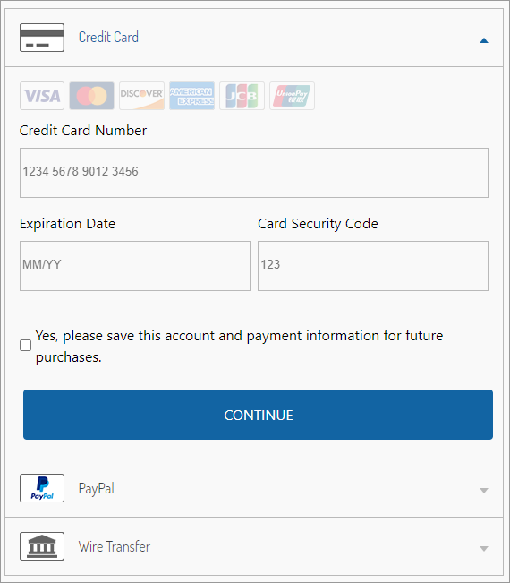

# User guide

## Product management

Product management consists of two aspects. First, the required product attributes must be configured for each product/sku. Next, the products must be synced to Digital River. This section details those steps.

Before Digital River can process the SKUs, you must complete all of the products with both the Tax Class and the Digital River custom attributes and send them to Digital River. This data is necessary for valid tax calculation. The absence of these attributes will result in errors when you run the SKU export job.

Digital River needs the optional HS Code property for duty calculation.


**Note**: If your Digital River account is configured for [Landed Costs](https://docs.digitalriver.com/digital-river-api/checkouts-and-orders/landed-costs), you will need to configure the HS Code on applicable products. This cartridge code processes duty and appears to customers as a separate total price component without any additional site configuration. To avoid duty inclusion, leave HS Code attributes blank or contact your Digital River Representative.



## Product sync jobs

After products have been configured, the data needs to be synced to Digital River. The cartridge provides the following jobs to sync products. It is recommended that these jobs are scheduled to run on a regular basis.

* The **DigitalRiver\_updateDigitalRiverSKUs** job will iterate through all products but send SKU data only for those products that haven’t been sent to Digital River or were modified afterward. We recommend you use this job for product data export.
* The **DigitalRiver\_OptionalDigitalRiverSKUsUpdate** is provided for exclusive occasions when there is a necessity to grant a merchant representative the possibility to request products export to Digital River without providing authority to manage jobs. Schedule this job to check periodically whether a merchant representative requested a SKU. If such was requested, an update will be made (same as the **updateDigitalRiverSKUs** job does). A merchant can force a product sync using the "Request SKU's Update" option in the Merchant Tools / Digital River. See Digital River Merchant Tools available in Business Manager for more details.

## Digital River merchant tools available in Business Manager <a href="#business-manager" id="business-manager"></a>

### Merchant tools

We added new Business Manager menu options under Merchant Tools.


* **Request SKU's update**—Click this button to request an SKU update on the Digital River-side with the next run of **OptionalDigitalRiverSKUsUpdate**. The button will show the corresponding text indicating that you can launch the job or that the job is running.


**Note**: Clicking **Request SKUs update** will not launch the job immediately, but it will raise a flag that must perform an update with the next run of `OptionalDigitalRiverSKUsUpdate`. If you haven't scheduled the job (in advance) in the Business Manager or (as an administrator) launched the job manually, clicking the button will have no impact at all.



* **Digital River Service Tester**—A button in Business Manager to test Digital River service availability.


Clicking the **Test Services** button will make calls to the indicated web services and evaluate response codes.

## Order information

The Digital\_River\_Dropin payment processor provides the following order information in Business Manager:

* Select **Merchant Tools**, select **Orders**, choose an order, and click **Payments**.
  * Payment type (creditCard, PayPal, and so on) is mentioned.
  * Hyperlink to order on Digital River [Dashboard](https://dashboard.digitalriver.com/login).


* Select **Merchant Tools**, select **Orders**, choose an order, and click **Notes**. A Digital River “create order” response is being saved in order notes.


* Added drExportedDate custom attribute to the Product. It is updated each time the job runs.

## Order state management

Digital River provides a range of order statuses to track order payment. Each order has a Digital River order status which reflects the current order position within the [order cycle](https://docs.digitalriver.com/digital-river-api/checkouts-and-orders/orders/the-order-lifecycle):

* **accepted**—order has passed checks and is ready for fulfillment
* **in\_review**—order is on fraud review and can’t be fulfilled yet
* **pending\_payment**—order has delayed payment and can’t be fulfilled yet
* **blocked**—order is blocked and must be cancelled
* **fulfilled**—order is fulfilled and is waiting for payment capture
* **complete**—order is fulfilled and has been paid

Digital River order status determines further order processing. Also, each order has a Digital River fraud status which shows the state of the order's fraud check:

* **passed**—order has passed the fraud check
* **review\_opened**—order is on fraud review
* **blocked**—order has not passed fraud check

Digital River fraud status doesn’t have a direct impact on order processing and is provided for user reference.

To see Digital River order and fraud states, select **Merchant Tools**, then select **Ordering**, and click **Orders**. Select the **order number** and choose the **Attributes** tab.


Initial Digital River status values are set after order placement and they define order processing scenarios.

| Digital River order status             | Order processing scenario                                                 |
| -------------------------------------- | ------------------------------------------------------------------------- |
| accepted                               | order will be processed                                                   |
| <p>pending_payment</p><p>in_review</p> | order will be put on hold until status changes to "accepted" or "blocked" |
| blocked                                | order will be cancelled                                                   |

## Order status management jobs

After the order is placed, the status update is handled through jobs that can be run or scheduled in the Business Manager. It is recommended to schedule these jobs on a regular basis.

* The /**DigitalRiver\_fulfillOrders/** job processes all orders that were shipped or cancelled but still have Digital River order status of “accepted.” For each order, [fulfillment](https://www.digitalriver.com/docs/digital-river-api-reference/#operation/createFulfillments) is sent to Digital River. After all orders are processed their statuses are updated through a separate [Digital River call](https://www.digitalriver.com/docs/digital-river-api-reference/#operation/listOrders). See the[ Order cancellation/fulfillment](user-guide.md#order-cancellation-fulfillment) section for more details.
* The **DigitalRiver\_updateCompletedOrders** job queries all orders that were shipped or cancelled but still have a Digital River order status of “accepted” and updates their status through a [Digital River call](https://www.digitalriver.com/docs/digital-river-api-reference/#operation/listOrders). Unlike “DigitalRiver\_fulfillOrders” this job doesn’t send fulfillments to Digital River and is applicable only in combination with other integrations when [drOrderHelper.notifyOrderFulfillment](user-guide.md#drorderhelper) or [drOrderHelper.notifyOrderCancellation](user-guide.md#drorderhelper) functions are injected into scripts responsible for shipping management/order cancellation.


**Important**: neither DigitalRiver\_fulfillOrders nor DigitalRiver\_updateCompletedOrders cancel orders or update shipping in the order management system, but only notify Digital River when the order or line item has been shipped or cancelled. Once notified, Digital River will[ capture the payment or cancel the charge](https://docs.digitalriver.com/digital-river-api/fulfillments/informing-digital-river-of-a-fulfillment). You can manage order shipping or cancellation in Business Manager or by other integrations, but it’s not within the scope of this cartridge functionality.


* The **DigitalRiver\_updatePendingOrders** job updates the state for all orders that have pending statuses (**in\_review**, **pending\_payment**, **fulfilled**) that wait for resolution on the DigitalRiver side.

In the following table, you can see all the statuses that you can expect to receive from Digital River and their impact on orders in SFCC for each respective state:


## Storefront functionality <a href="#storefront-functionality" id="storefront-functionality"></a>

The DigitalRiver.js library replaces the Salesforce built-in payment method forms and also renders Digital River Drop-in payment integration to fulfill the payment process. The payment methods will display on the billing page. The payment methods that display depend on the configuration of your LINK cartridge key by Digital River. Visit our [Drop-in documentation](https://docs.digitalriver.com/digital-river-api/payment-integrations-1/drop-in) for an updated listing of payment methods available.

Below is how payment methods will appear on the billing page:\
&#x20;&#x20;

* When the customer clicks the **Add New** link in the **My Account** section, the **Drop-in** form with the specific configuration will appear. The form allows the customer to add a new payment within **Drop-in** and create a new source.


## Order cancellation/fulfillment

Though order and line level fulfillment or cancellation within SFCC or an order management system is not within the scope of the current cartridge, it’s necessary to notify Digital River each time such an operation takes place. Once notified, Digital River will capture the [payment or cancel the charge](https://docs.digitalriver.com/digital-river-api/fulfillments/informing-digital-river-of-a-fulfillment). You can do this in two ways:

1. Use the [**DigitalRiver\_fulfillOrders**](user-guide.md#order-status-management-jobs) job. This job is available out of the box. This job provides order level fulfillment and cancellation. It will choose orders with **Shipped** or **Cancelled** statuses and provide respective fulfillment to Digital River. Line level fulfillment and cancellation is not included in this job. It is recommended that this job is scheduled to run on a regular basis.\
   In the Business Manager, change the Shipping Status to “Shipped” to fulfill the order. \
    \
   To cancel the order, change the Order Status to “Cancelled”.\
   &#x20; \
   The next time the **DigitalRiver\_fulfillOrders** job runs, the fulfillment or cancellation request will be sent to Digital River.
2. If URL endpoints or 3rd party integration perform order fulfillment/cancellation, you can inject the drOrderHelper module in the code to send fulfillments to Digital River. To do so, import the module:

```
var drOrderHelper = require('*/cartridge/scripts/digitalRiver/drOrderHelper');
```

And use one of two functions that will create fulfillments at Digital River.

#### drOrderHelper

```
drOrderHelper.notifyOrderFulfillment(order, items);
drOrderHelper.notifyOrderCancellation(order, items);
```

Functions accept two arguments:

* **order**—The updated order number or [actual order](https://documentation.b2c.commercecloud.salesforce.com/DOC1/index.jsp?topic=%2Fcom.demandware.dochelp%2FDWAPI%2Fscriptapi%2Fhtml%2Fapi%2Fclass\_dw\_order\_Order.html\&resultof=%22%63%6c%61%73%73%22%20%22%4f%72%64%65%72%22%20%22%6f%72%64%65%72%22%20) object.​
* **items**—Array of order [product line items](https://documentation.b2c.commercecloud.salesforce.com/DOC1/index.jsp?topic=%2Fcom.demandware.dochelp%2FDWAPI%2Fscriptapi%2Fhtml%2Fapi%2Fclass\_dw\_order\_ProductLineItem.html\&resultof=%22%63%6c%61%73%73%22%20%22%50%72%6f%64%75%63%74%4c%69%6e%65%49%74%65%6d%22%20%22%70%72%6f%64%75%63%74%6c%69%6e%65%69%74%65%6d%22%20) or order line items IDs that should be fulfilled. This parameter is provided for partial fulfillment/cancellation.&#x20;


**Note**: At this time, partial line item fulfillments and cancellations are not supported.


Functions return the [Result](https://documentation.b2c.commercecloud.salesforce.com/DOC1/index.jsp?topic=%2Fcom.demandware.dochelp%2FDWAPI%2Fscriptapi%2Fhtml%2Fapi%2Fclass\_dw\_svc\_Result.html\&resultof=%22%63%6c%61%73%73%22%20%22%52%65%73%75%6c%74%22%20%22%72%65%73%75%6c%74%22%20) of the [Digital River](https://www.digitalriver.com/docs/digital-river-api-reference/#operation/createFulfillments) call.

## Refunding an order

Refunds are handled through the Digital River dashboard. From Salesforce, you can get to the order record in the Digital River dashboard by navigating to the Order record and clicking on the Payment tab. A link to the dashboard is provided in the Payment Method section.


