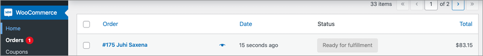
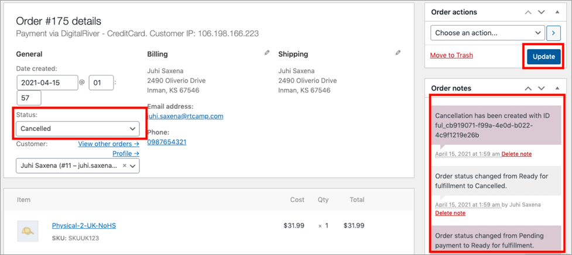
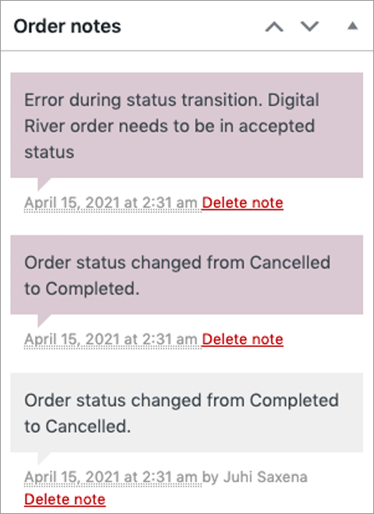

# Cancel an order

There are a few conditions when cancelling the WooCommerce order with this Digital River plugin:

1. The order can only be cancelled by the store admin, customers don’t have the provision to cancel the order.
2. The order can only be cancelled if the order’s status is **Ready for fulfillment**. The **Enable automatic fulfillment** must be de-selected under the **Digital River** tab in **Payments** to prevent the order to be fulfilled automatically.  &#x20;

To cancel the order, go to **WooCommerce**, click **Orders**, and then click the order. Make sure the order status is **Ready for fulfillment**.

Once you click the order, you will see the screen below.&#x20;

1. Choose the **Cancelled** status from the **Status** dropdown.
2. Click **Update**. You will see the order notes on the right side. If it’s successful, it will show **Cancellation has been created with ID.**&#x20;

If you try to cancel the completed order, that is an order with a **Completed** status, you will see the following error message:

\

