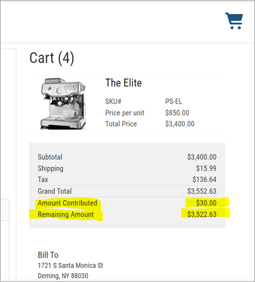

# Customer credit

The shopper can add customer credit to the payment page.&#x20;


The user interface for adding customer credit to the checkout will vary based on the use case and how it is implemented on the storefront.  We don’t provide screenshots of this feature since we expected you to customize it per your requirements.


Whenever a shopper adds or removes customer credit from the checkout, the Checkout Summary, and Drop-in components will be refreshed to reflect the updated Amount Contributed and Remaining Amount values.

