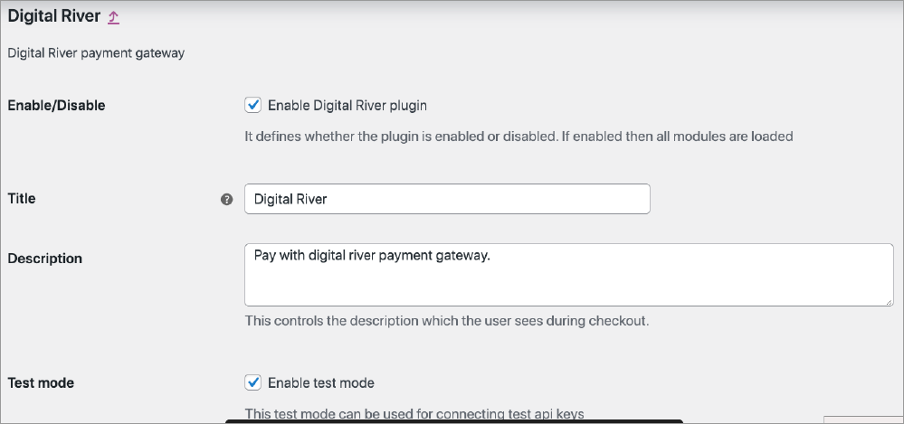
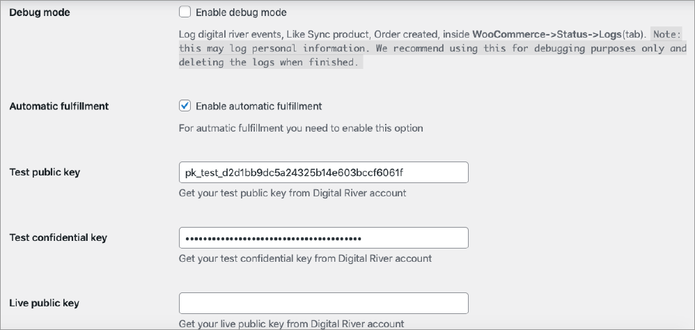

# Enable extension settings

This extension adds the **Digital River** payment method under the **WooCommerce Payment** tab. Go to **WooCommerce**, select **Settings**, and then click **Payment**.

You will notice **Digital River** is already enabled. We keep the **Digital River** payment option enabled by default.&#x20;

.png>)

Click **Manage**. It gives you the option to **Enable Digital River plugin** and configure the options below.


**Caution**: If **Enable Digital River plugin** is not selected, anything apart from the **Settings** page will not work. Make sure to keep it selected.


1. **Title**: You can configure the **Title** from here which will appear on the checkout page.&#x20;
2. **Description**: You can configure the **Description** from here which will appear on the checkout page.\
   &#x20;&#x20;
3. **Test mode**: To enable the test mode, select the **Enable test mode**. If **Test mode** is enabled, then **Test API credentials** will be used.
4. **Debug mode**: To enable the debug mode, select the **Enable test mode**. If **Debug mode** is enabled, results will appear in the log. To view the log, go to **WooCommerce**, select **Status**, and then click the **Logs** tab.
5. **Enable automatic fulfillment**: This extension feature enables the automatic fulfillment of orders. Once the order is in the accepted state, it will be fulfilled by WooCommerce automatically. This ensures that the store admin will not have to fulfill every order manually. This is particularly useful where stores get large orders in a short time when it would be difficult for the store admin to go through each order manually and fulfill it. \
   &#x20;
6. **Test public key & Test confidential key**: Configure the test credentials. These credentials will be used only when **Test mode** is enabled. ****&#x20;
7. **Live public key & Live confidential key**: Configure the live credentials. These credentials will be used when **Test Mode** is not enabled.
8. **Webhook secret key**: Configure webhook secret key. Use this key to manage the order status.
9. **Test API Configuration**: To determine if the API configuration is working correctly, click **Test Config**. .png>)&#x20;

