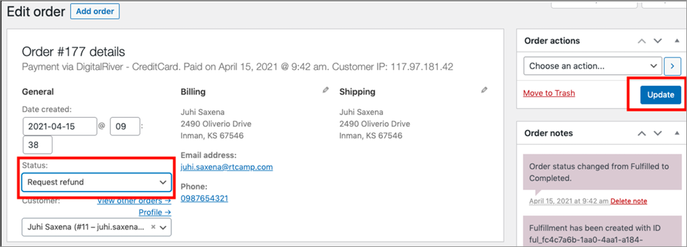
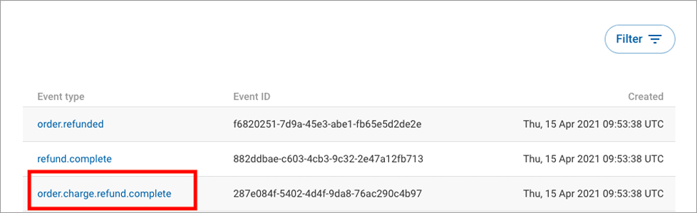

# Refund the order

To refund the WooCommerce order with this Digital River extension:

1. Go to **WooCommerce**, click **Orders**, and then click the order which the customer wants to be refunded.&#x20;
2. Choose the **Request Refund** from the **Status** dropdown and click **Update**.


You can only refund the order when the order status is **Completed**.


This extension listens to the `order.charge.refund.complete` event, which you can see on the Digital River Dashboard under **Event logs**. Once the plugin listens to this event, it marks the order as **refunded**.   &#x20;

.png>)

If you try to refund the order which has a status other than **Completed**, you will see the following error message:

.png>)

