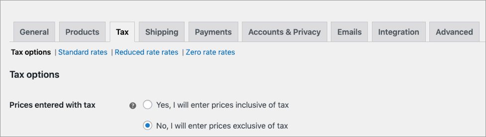

# Tax

See [Enable taxes](../../configuring-the-woocomerce-plugin/configure-general-settings.md#enable-taxes) in the [Configure general settings](../../configuring-the-woocomerce-plugin/configure-general-settings.md) section.

## Prices entered with tax

To configure taxes, go to **WooCommerce**, select **Settings**, then select **Tax**.

The option you choose here is important when managing taxes in your store. It determines how you input product prices later on. Your options are as follows:&#x20;

* **Yes, I will enter prices inclusive of tax** means that all catalog prices are entered using your store’s base tax rate.&#x20;
* **No, I will enter prices exclusive of tax** means that your catalog prices need to be tax exclusive.

For this example, **No, I will enter prices exclusive of tax** is selected.

### Select shipping address for calculations&#x20;

1. Go to **WooCommerce**, select **Settings**, then select **Tax**.&#x20;
2. In the **Calculate tax based on** field, select **Customer shipping address**.

## Display prices in the shop

This option determines how prices are displayed in your shop or catalog. Choose from an inclusive or exclusive tax display. If you choose **inclusive**, prices will be shown inclusive of taxes although you have selected **No, I will enter prices exclusive of tax**. Digital River does the tax calculation. &#x20;
