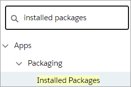
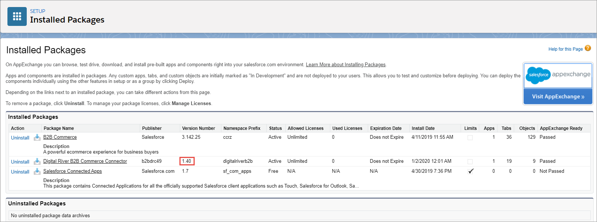

# Version number

If you need the version number of the installed Salesforce B2B Commerce App:

1. Click **Setup**  and select **Setup** from the dropdown list.
2. Type `installed packages` in the **Quick Find** field and press **Enter**. \
   
3. Click **Installed Packages**. The Installed Packages page appears.
4. The **Version Number** column displays the version number for the Digital River Salesforce B2B Commerce App.

